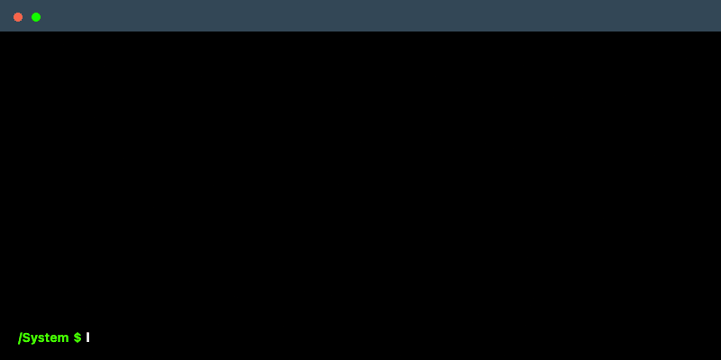

# Hi 👋, I'm Mohamed

### A human telecom engineer with SMO / O-RAN passion

 

  

 

<!-- 

  

 -->

 

    

 

## About Me

- 👋 I'm an **RF Telecommunication Engineer**
- 🔭 Currently working on **SMO Project**
- 🌱 Learning **as much as possible**
- 🤝 Looking for help with **rApp ideas**
- 💬 Ask me about **RF Optimisation, especially Ericsson**
- 📫 Reach me at **moh.elbasyouni@gmail.com**

## Core Skills

## Tools & Platforms

## GitHub Stats

  

